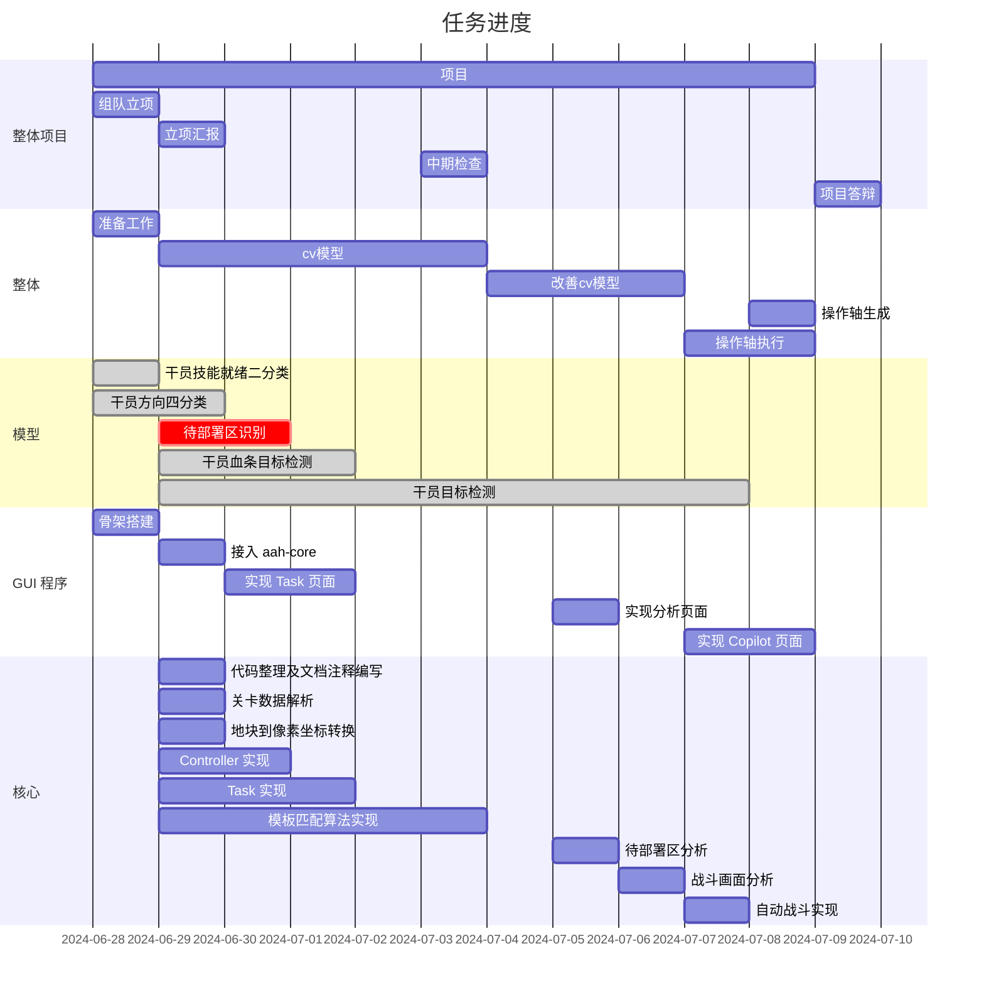
```mermaid
gantt
    title 任务进度
    dateFormat  YYYY-MM-DD
    section 整体项目
    项目											  :2024-06-28, 2024-07-09
    组队立项           								 :a1, 2024-06-28, 1d
    立项汇报           								 :a2, 2024-06-29, 1d
    中期检查                                         :a3, 2024-07-03, 1d
    项目答辩           								 :a4, 2024-07-09, 1d
    section 整体
    准备工作   :prepare, 2024-06-28, 1d
    cv模型    :cv, after prepare, 5d
    改善cv模型 :cvp, after cv, 3d
    操作轴生成 :2024-07-08, 1d
    操作轴执行 :2024-07-07, 2d
    section 模型
    干员技能就绪二分类 :done, 2024-06-28, 1d
    干员方向四分类    :done, 2024-06-28, 2d
    待部署区识别      :crit, 2024-06-29, 2d
    干员血条目标检测    :done, 2024-06-29, 3d
    干员目标检测    :done, 2024-06-29, 9d
    section GUI 程序
    骨架搭建          :2024-06-28, 1d
    接入 aah-core    :2024-06-29, 1d
    实现 Task 页面   :2024-06-30, 2d
    实现分析页面       :2024-07-05, 1d
    实现 Copilot 页面 :2024-07-07, 2d
    section 核心
    代码整理及文档注释编写 :2024-06-29, 1d
    关卡数据解析         :2024-06-29, 1d
    地块到像素坐标转换    :2024-06-29, 1d
    Controller 实现 :2024-06-29, 2d
    Task 实现 :2024-06-29, 3d
    模板匹配算法实现 :2024-06-29, 5d
    待部署区分析 :2024-07-05, 1d
    战斗画面分析 :2024-07-06, 1d
    自动战斗实现 :2024-07-07, 1d
```

## 功能分析

AAH 明日方舟助手需要实现的功能有：

（1）自动执行明日方舟游戏的一些任务如登录、领取奖励等，并显示执行情况。

（2）对正在进行中的一场战斗的战斗状态和场中的干员状态进行分析，并将分析结果可视化。

（3）依据战斗文件进行自动战斗，包含部署干员、撤离干员、释放技能等操作。

（4）分析战斗视频生成战斗文件

## 概述

### 1. 仓库结构

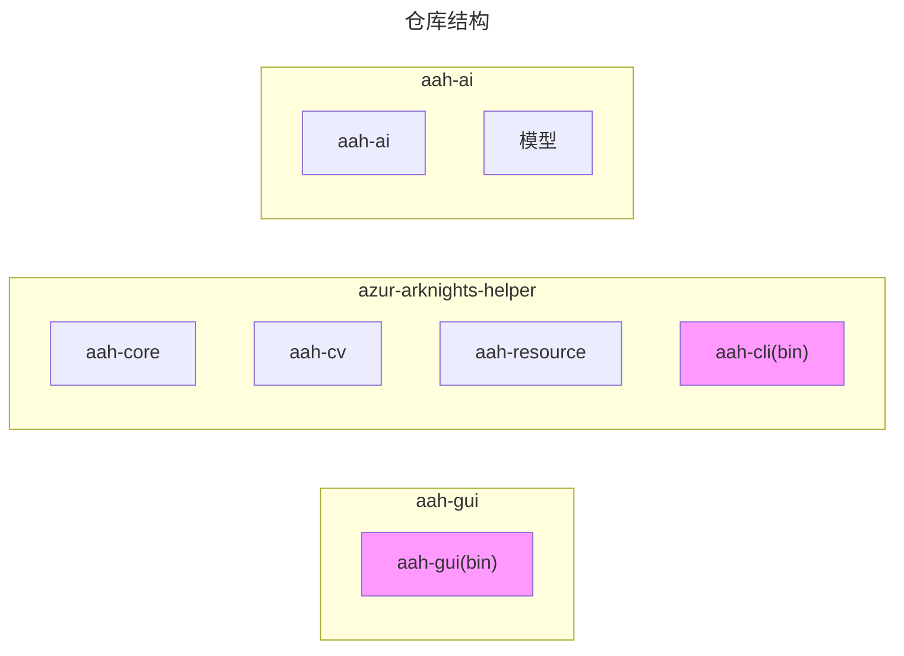
```mermaid
---
title: 仓库结构
---
flowchart LR

subgraph gui[aah-gui]
	aah-gui["aah-gui(bin)"]:::bin
end

subgraph azur-arknights-helper
    aah-core
    aah-cv
    aah-resource
    aah-cli["aah-cli(bin)"]:::bin
end

subgraph ai[aah-ai]
	aah-ai
	模型
end

classDef lib fill:#f96
classDef bin fill:#f9f
```

- **仓库 aah-ai**：AI 相关
    -  rust crate<mark style="background: #FFF3A3A6;">lib</mark> `aah-ai`：AI 模型封装，基于 onnxruntime 进行推理

- **仓库 aah-gui**：GUI 应用
    -  rust crate<mark style="background: #D2B3FFA6;">bin</mark> `aah-gui`：GUI 应用，使用 Tauri(Solidjs + Rust)

- **仓库 azur-arknights-helper**：核心以及 CLI 应用
    -  Rust crate<mark style="background: #FFF3A3A6;">lib</mark> `aah-core`：核心
    -  Rust crate<mark style="background: #FFF3A3A6;">lib</mark> `aah-cv`：一些使用 Rust 重新实现的 OpenCV 算法
    -  Rust crate<mark style="background: #FFF3A3A6;">lib</mark> `aah-resource`：处理游戏数据相关
    -  Rust crate<mark style="background: #D2B3FFA6;">bin</mark> `aah-cli`：CLI 应用


### 2. 模块关系

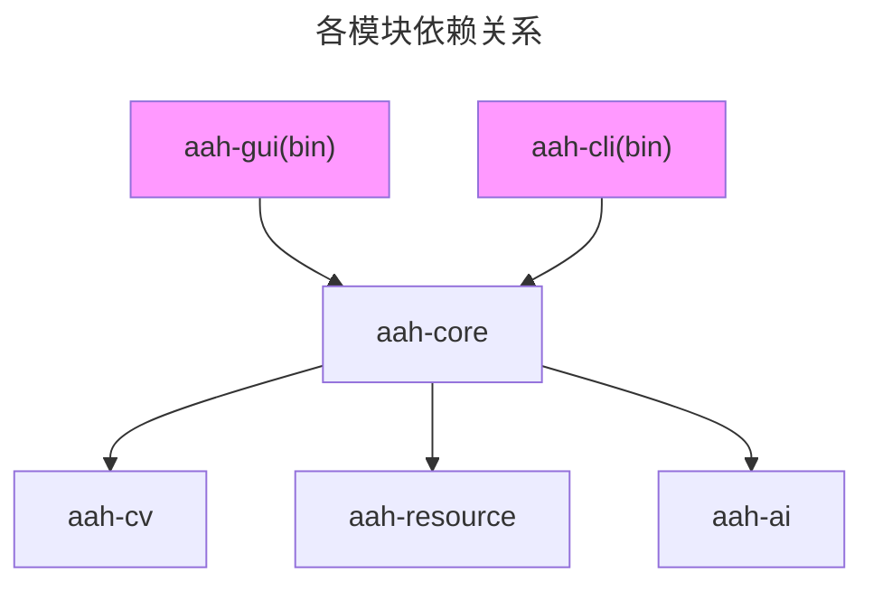
```mermaid
---
title: 各模块依赖关系
---
flowchart

aah-gui["aah-gui(bin)"]:::bin
aah-gui --> aah-core

aah-cli["aah-cli(bin)"]:::bin
aah-cli --> aah-core

aah-core
aah-cv
aah-resource

aah-core --> aah-cv
aah-core --> aah-resource
aah-core --> aah-ai

aah-ai

classDef bin fill:#f9f
```

## 核心部分

### 1. 设备控制

基于 Adb 实现触控、截图等设备控制功能。

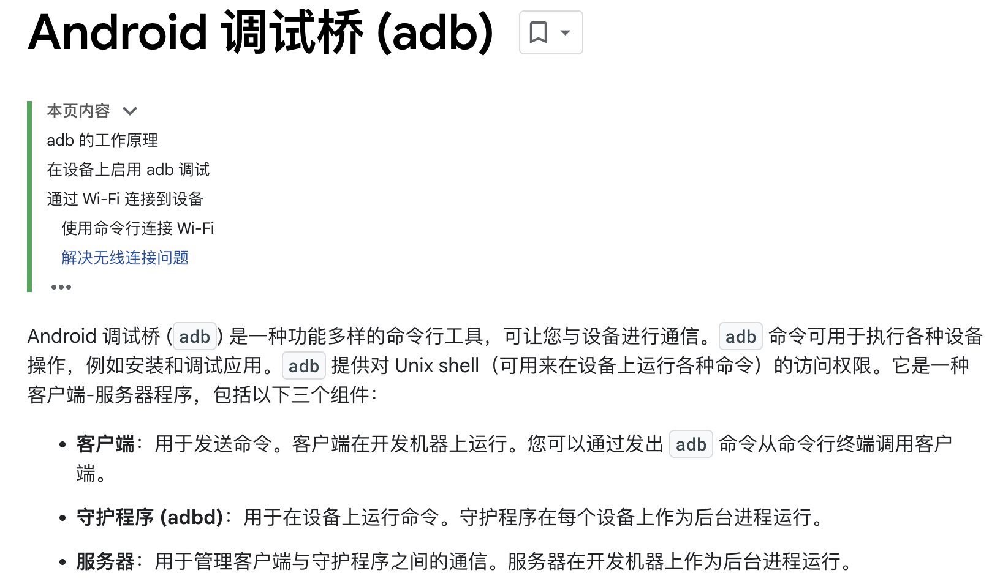

> 内容来源：[Android 调试桥 (adb)  |  Android Studio  |  Android Developers](https://developer.android.com/tools/adb?hl=zh-cn#screencap)

**优化**：「客户端」与「服务器」之间的通信是基于字符的 TcpStream 的，因此可以通过直接通过 TcpStream 按照服务器协议与其通信来省去进程调用的消耗。

#### 1.1 截图

基于 `adb shell exec-out screencap -p` 命令。

测试：

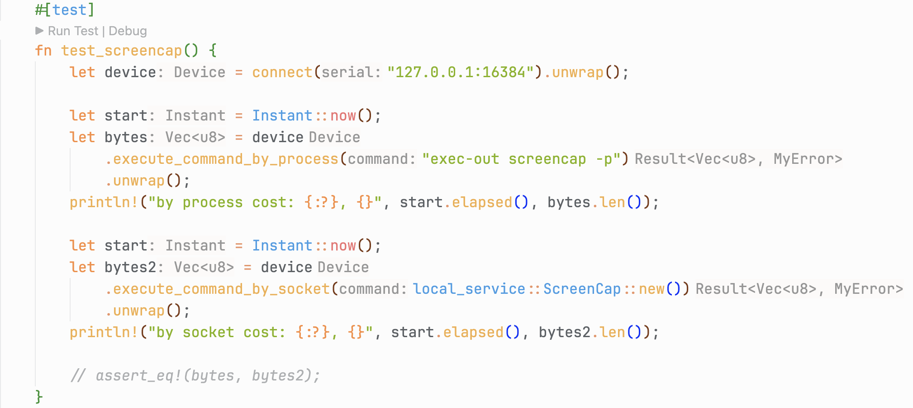

```
---- adb::test::test_screencap stdout ----
by process cost: 712.14525ms, 2621957
by socket cost: 674.283417ms, 2620505
```

---

**Minicap**

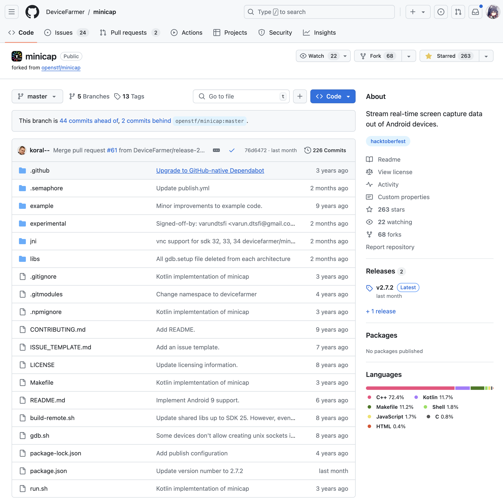

```
ABI=$(adb shell getprop ro.product.cpu.abi | tr -d '\r')
adb push libs/$ABI/minicap /data/local/tmp/
SDK=$(adb shell getprop ro.build.version.sdk | tr -d '\r')
adb push jni/minicap-shared/aosp/libs/android-$SDK/$ABI/minicap.so /data/local/tmp/
adb shell LD_LIBRARY_PATH=/data/local/tmp /data/local/tmp/minicap -P 1080x1920@1080x1920/0 -t
```

**效果**：平均 400ms，127.0.0.1:16384

```
[Minicap]: header: 1920x1080@1920x1080/0 2
[Minicap]: new frame(318405 bytes), decoding...
[Minicap]: updated screen_cache, cost: 398.688958ms
[Minicap]: new frame(33267 bytes), decoding...
[Minicap]: updated screen_cache, cost: 258.00825ms
[Minicap]: new frame(318219 bytes), decoding...
[Minicap]: updated screen_cache, cost: 406.642834ms
[Minicap]: new frame(318253 bytes), decoding...
[Minicap]: updated screen_cache, cost: 404.737125ms
[Minicap]: new frame(318538 bytes), decoding...
[Minicap]: updated screen_cache, cost: 401.83975ms
[Minicap]: new frame(317675 bytes), decoding...
[Minicap]: updated screen_cache, cost: 405.639458ms
[Minicap]: new frame(315526 bytes), decoding...
[Minicap]: updated screen_cache, cost: 403.249541ms
[Minicap]: new frame(315892 bytes), decoding...
[Minicap]: updated screen_cache, cost: 395.771958ms
[Minicap]: new frame(316726 bytes), decoding...
```

**<font color="red">问题</font>**：sdk-32、sdk-31 的 `x86_64` 的 `.so` 文件是 `i386` 的，而仓库作者不太维护了，只能暂时搁置。

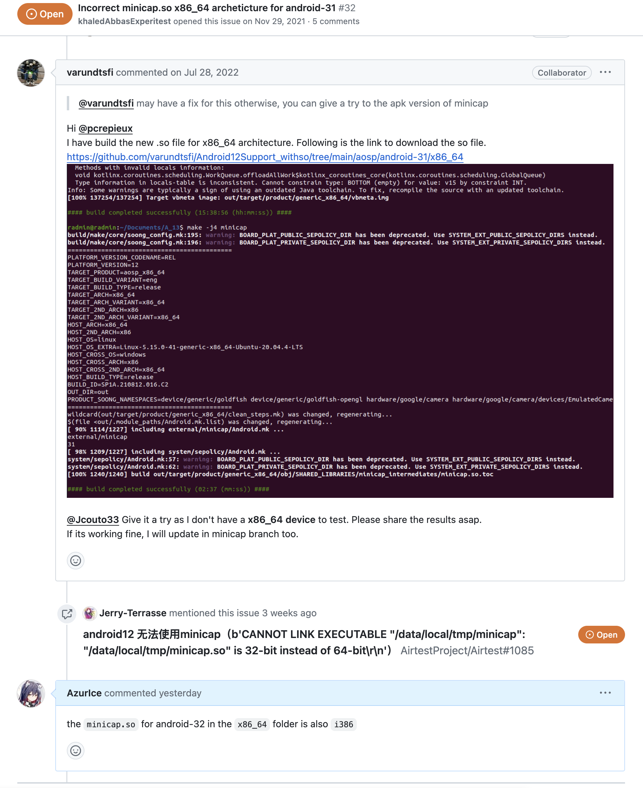

#### 1.2 触控

基于 `adb shell input` 命令

#### 1.3 总结

最终封装结果：

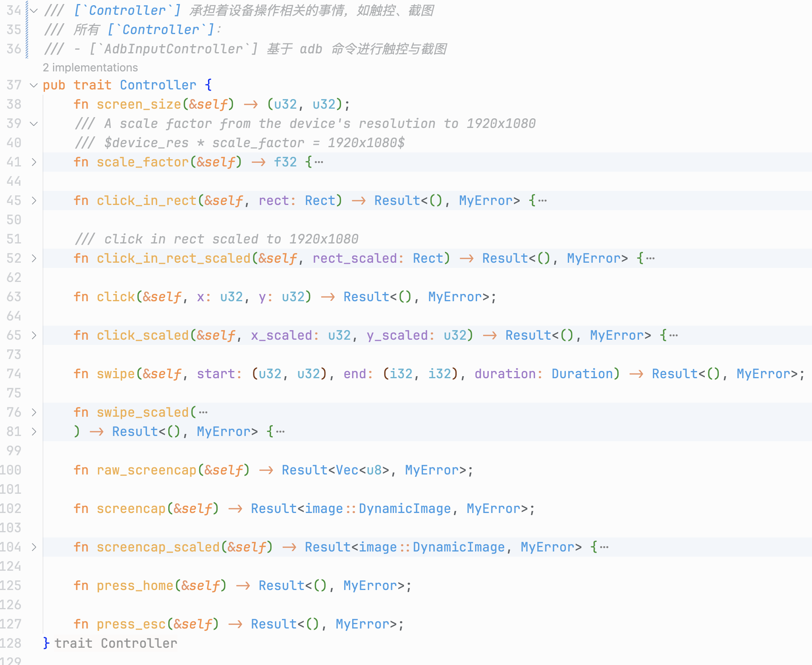

### 2. 任务系统

基于 TOML 进行配置，任务之间可以互相引用：

```toml
[Multi]
fail_fast = false
tasks = [
    { ActionClickMatch = { match_task = { type = "Template", template = "start_start.png" }, wrapper = { retry = 1 } } },
    { ActionClickMatch = { match_task = { type = "Template", template = "wakeup_wakeup.png" }, wrapper = { delay = 2, retry = 5 } } },
    # 月卡
    { ActionClickMatch = { match_task = { type = "Template", template = "confirm.png" }, wrapper = { delay = 4, retry = 2 } } },
    { ActionClickMatch = { match_task = { type = "Template", template = "qiandao_close.png" }, wrapper = { delay = 2, retry = 2 } } },
    # 公告
    { ActionClickMatch = { match_task = { type = "Template", template = "notice_close.png" }, wrapper = { delay = 2, retry = 2 } } },
]
```

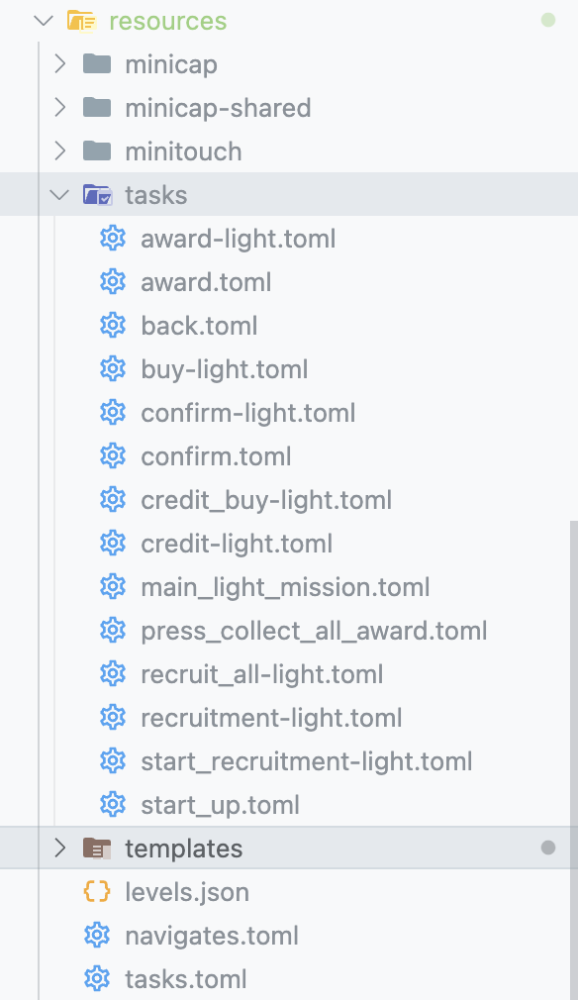

#### 1.1 任务

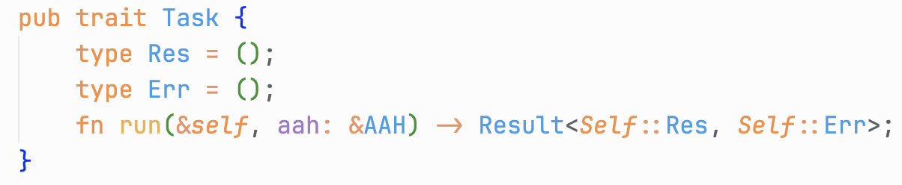

内置任务可由 TOML 使用：

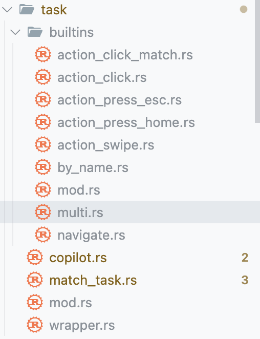

### 3. cv 部分

- 使用 Rust 直接在 CPU 上实现

    单核在 2560x1440 的图像中匹配 159x158 的模板：<font color="red">十分钟</font>

    使用 rayon 库多核并行在 2560x1440 的图像中匹配 159x158 的模板：<font color="orange">七分钟</font>

- 使用 wgsl 编写 compute shader 并通过 Rust 的 wgpu 库在 GPU 上运行：

    16x16 workgroup 并行：<font color="green">0.7549291s</font>

- fft

    互相关系数模板匹配其实就是卷积，而这件事可以通过 fft 加速：

    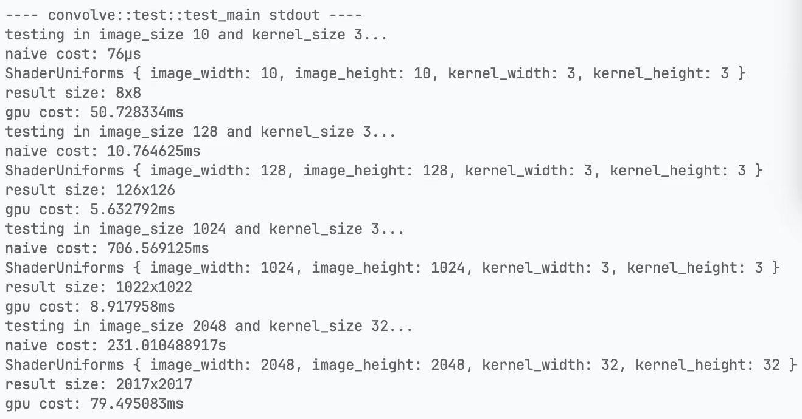

    最后得出的结果就是，还不如在 GPU 上直接算快。

    fft 虽然把 $O(n^2)$ 优化成了 $O(n\log n)$ 但是还是有极大的消耗。

    之后考虑到每一层的蝶形运算是可以并行做的，于是尝试实现在了 GPU 上的 fft：

    ```
    testing in size 65536...
    naive fft cost: 26.032667ms
    gpu fft cost: 87.053042ms
    ```

    并行大小是有限制的（65536），如果要支持蝶形运算数超过这个数的一层的运算，就要分多次进行运算，而这个就会变得特别复杂。

    于是只尝试了一下 65536 大小的傅立叶变换，发现甚至不如 CPU，其原因是，数据以及指令传输占了大部分时间（70ms 左右）

    所以后面也就没再想 fft 的事了。

最终就是对每一个匹配算法，写一个对应的 shader，在 GPU 上用 16x16 的 workgroup 并行跑。

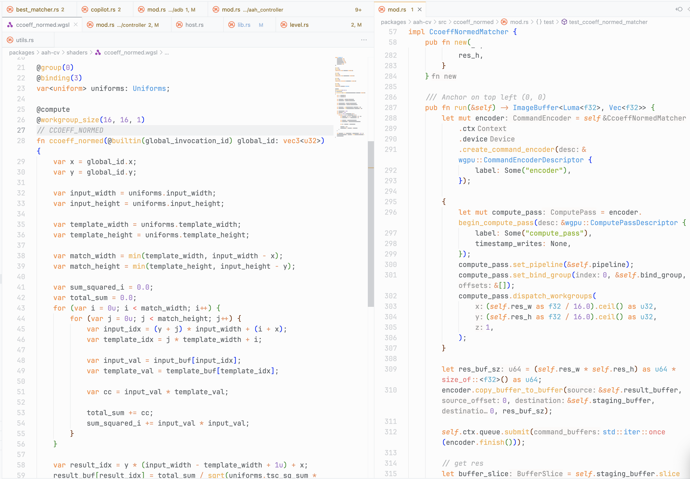

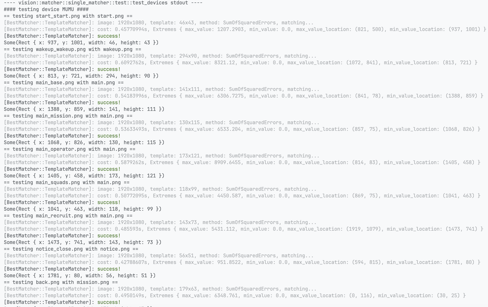

## 模型部分

### 1. 干员方向四分类


 [MnistSimpleCNN](https://arxiv.org/abs/2008.10400)，输入是 720p 下以格子正中心 96x96 的图片

### 2. 干员技能图标就绪二分类

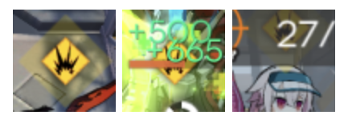

[Inception v1](https://arxiv.org/abs/1409.4842v1)，输入需要是 720p 下截取的 64x64 的图片

### 3. 干员检测

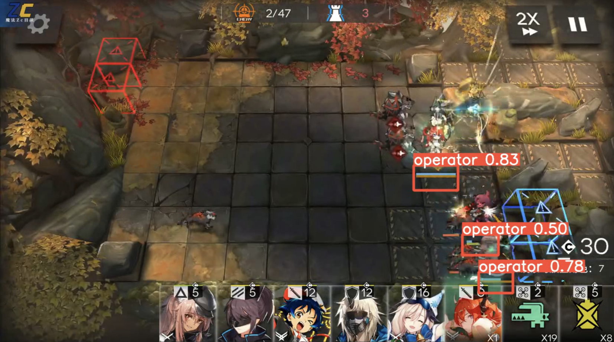

yolov8n，输入是 16:9 的图片缩放到 640x640

### 4. 场上干员目标检测

基于 yolov8n，准确率可以，不过遮挡等复杂情况会受到影响


## 功能手册

### 1.设备连接与断开

用户可以输入序列号点击“建立连接”按钮连接对应的设备，同时也可以随时通过点击“断开连接”按钮断开连接。通过调用后端的 connect 和 disconnected 函数实现建立连接和断开连接。

### 2.Main Page

Main Page 部分包括获取屏幕画面、可执行任务列表、执行任务、显示任务执行情况、分析部署等功能。

**获取屏幕画面**：应用会通过用户输入的序列号与对应的设备建立连接，前端调用后端的 get_screen 函数获得屏幕画面数据，然后将屏幕数据绘制在 canvas 上。

**获取任务列表**：建立连接之后，前端需要在页面中显示可执行的任务列表。前端调用后端的 get_tasks 函数可以获得后端任务数据，然后在前端进行对应的数据显示。

**执行任务**：在前端显示的任务列表中，每个任务的右侧都有一个可点击的“执行任务”按钮。用户点击想要执行的任务右侧的按钮时，前端就会把对应的任务名作为参数传给后端的 run_task 函数，后端就会执行对应的任务，并返回任务执行的日志信息到前端。

**显示任务执行情况**：这一部分功能的完成利用了 Tauri 中的event特性，在建立连接之后，点击执行任务后后端的任务事件回调函数就会把任务执行的日志信息和任务执行过程中的图片 emit 到前端，前端 listen 对应的事件名就可以接收到这些数据并更新前端页面。

**分析部署**：当用户进入了一局战斗时，点击前端的“分析部署”按钮，前端就会调用后端的 get_deploy_analyze_result 函数，该函数可以将战斗当前画面的部署分析结果图像数据返回给前端，前端拿到数据后就可以更新前端画面。

### 3.Battle Page

Battle Page 部分包括获取当前战斗状态和干员相关状态。

**获取战斗状态和干员状态**：这一部分功能的完成同样利用了Tauri中的event特性，当用户进入了一局战斗时，点击前端的“ROCK AND ROLL”按钮，就可以将当前的战斗状态以及这场战斗中所有干员的位置信息、是否可用信息等返回到前端，前端就会在对应的地方显示这些信息，这些信息也是在任务回调函数中被emit到前端的。

### 4.Copilot Page

Copilot Page 部分包括可执行 Copilot 列表，执行 Copilot，显示 Copilot 的执行情况。

**获取 Copilot 列表**：建立连接之后，前端需要在页面中显示可执行的 Copilot 列表。前端调用后端的get_copilots 函数可以获得后端的 copilot 数据，然后在前端进行对应的数据显示。

**执行 Copilot**：在前端显示的copilot列表中，每个 copilot 右侧都有一个可点击的“执行 copilot”按钮。用户点击想要执行的copilot右侧的按钮时，前端就会把对应的 copilot 名作为参数传给后端的 run_copilot 函数，后端就会执行对应的 copilot，并返回 copilot 执行的相关信息到前端。

**显示 Copilot 的执行情况**：与显示任务执行情况类似，利用 Tauri 中的 event 特性，如果有 copilot 在执行，就把执行过程中的日志信息 emit 给前端，前端对这些数据进行展示。

## 功能演示

### 1. aah-cli

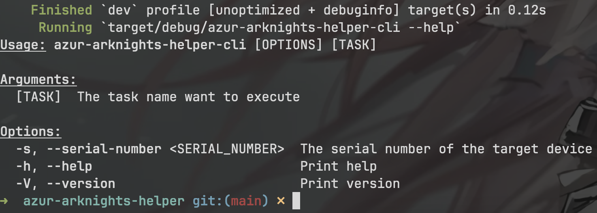

「开始唤醒」任务：

<video src="./assets/start_up.mp4"></video>

「领取任务奖励」任务：

<video src="./assets/award.mp4"></video>

### 2. aah-gui

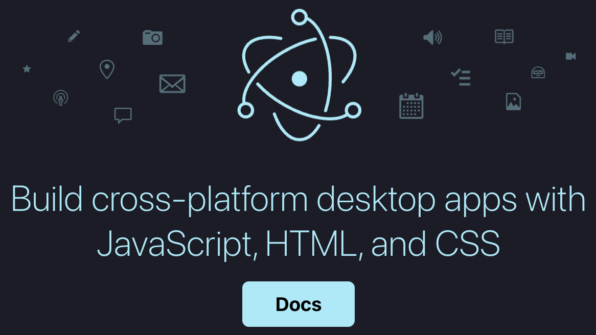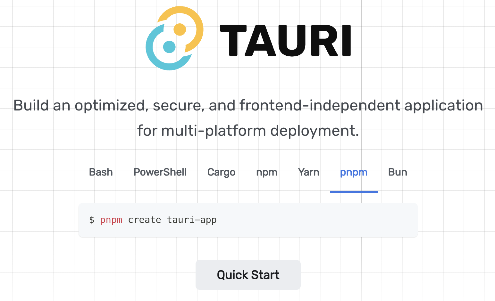

「前端」进程即展示的界面，「后端」进程负责与操作系统交互，二者之间通过 IPC 来通信。

Electron(Chromium) --> Tauri(WRY)

Electron(Frontend + JS) --> Tauri(Frontend + Rust)

GUI 应用执行任务：

<video src="./assets/gui_award.mp4"/>

GUI 应用展示 Analyzer 分析结果：

<video src="./assets/gui_deploy-analyze.mp4"/>

## 开发记录

- 2024-06-28

    - 讨论项目想法，最终采纳 @肖斌 提出的「明日方舟助手」想法。

    - @肖斌 进行技术选型、创建仓库

        共有三个仓库：

        - `azur-arknights-helper`：@肖斌 之前闲暇时间的产物，整个助手的核心部分

            > 负责人：@肖斌

            整个仓库已有基本的架构及功能，包含基于 Adb 的设备控制器的实现（具备连接、触控、截图等基本功能），还有一些基于模板匹配的简单的自动化操作。

            本仓库为一个 Cargo Workspace，其中有多个 package：

            - `azur-arknights-helper-cli`（根 Package）

                binary crate（可执行程序）：提供了简单的 CLI

            - `packages/aah-core`

                lib crate（库）：包含助手的实例结构、adb、任务、控制器、视觉分析等的逻辑

            - `packages/aah-cv`

                lib crate（库）：包含一些常见 CV 方法的 Rust 实现（如模板匹配）

            - `packages/aah-resource`

                lib crate（库）：包含一些游戏资源处理相关的逻辑（如数据解析、地块对应屏幕像素坐标计算等）

        - `aah-ai`：AI 模型仓库，以及 Rust API

            > 负责人：@杨鹏、@王彦博

            训练：使用 Python 训练，导出为 ONNX 运行时可加载的文件。

            推理：使用 Rust 加载 ONNX 文件进行推理，提供 Rust API。

        - `aah-gui`：图形界面桌面程序仓库

            > 负责人：@唐博文、@田佳文

            基于 Tauri（前端技术 + Rust）

    - 在组内对所用技术及工作流进行了基本的讲解。

    - 尝试、讨论明晰了开发路线。

- 2024-06-29

    - @肖斌 查阅资料分析得到待部署区识别方案

    - `aah-ai`：
        - @王彦博、@杨鹏 完成了基础的几个模型：
            1. 场上干员方向四分类
            2. 场上干员技能就绪而分类
            3. 干员血条的目标检测
        - @杨鹏 对模型进行了对应 Rust 推理逻辑的编写
        - @王彦博 开始训练对待部署区干员的目标检测
        - <font color="blue">@唐博文 完成了 OCR 模型的导出</font>
    - `aah-gui`：
        - @唐博文 完成了基本的展示设备画面的界面（前端）
        - @田佳文 完成了基本的获取图像 api 逻辑（Rust）
        - @田佳文 完成了与 `aah-core` 的基本对接（Rust）
    - `azur-arknights-helper`：
        - @肖斌 完成了代码整理和相关文档注释以供 `aah-gui` 使用
        - @肖斌 完成了对游戏资源中 `levels.json`（关卡数据）的解析
        - @肖斌 完成了「地块坐标」到对应「屏幕像素坐标」的计算实现
    
- 2024-06-30

    - `azur-arknights-helper`：
        - @肖斌 待部署区卡片识别
    
- 2024-07-01

    - `aah-ai`：
        - @杨鹏 基于进程运行命令完成 OCR 的封装
        - @王彦博 继续炼丹
    - `aah-gui`：
    - `azur-arknights-helper`：
        - @肖斌 完成对 OpenCV 中 CCOEFF_NORMED 模板匹配方法的 rust wgpu 加速实现（但是和 OpenCV 不是很一致）
        - @肖斌 引入 minicap，优化截图速度

- 2024-07-02

    - `aah-ai`:
        - <font color="blue">@肖斌 示范 PaddleOCR onnx 推理代码阅读</font>
        - @杨鹏对导出的OCR检测模型进行调用
        - <font color="blue">@唐博文 将PaddleOCR模型格式转换为onnx格式</font>
        - @王彦博 基于YOLOv8模型训练待部署区干员（337类）进行识别模型
        - <font color="blue">@田佳文 添加模式识别脚本 </font>
    - `azur-arknights-helper`：
        - @肖斌 优化截图数据传输速度
        - @肖斌 重构 Controller
    - `aah-gui`：
        - <font color="blue">@肖斌 重构界面</font>
        - @唐博文 在前端添加分析部署按钮，获取后端分析部署后的图像数据

- 2024-07-03
  
  - `aah-ai`:
    - <font color="blue">@肖斌 示范 PaddleOCR onnx 推理代码阅读</font>
    - @杨鹏了解导出的OCR识别模型
    - <font color="blue">@唐博文 标注YOLO8验证集</font>
    - @王彦博 添加多个干员叠加图片数据集以及暗处理数据集继续炼丹
    - <font color="blue">@田佳文 制作场上干员数据集</font>
  - `azur-arknights-helper`：
      - @肖斌 开始实现 Copilot，完成从关卡选择界面进入关卡的操作实现
  - `aah-gui`：
    - @唐博文 添加优化组件CircularProgress等
    - @田佳文 后端添加分析部署函数
  
- 2024-07-04
  - `aah-ai`:
    - @杨鹏、<font color="blue">@唐博文</font> 阅读 PaddleOCR onnx 推理脚本
    - @王彦博 生成场上干员数据集（10个干员，单个关卡，固定位置，4个方向），并训练，效果还可以。对于遮挡处理不够好
    - <font color="blue">@田佳文 制作场上干员数据集，扩充数据集</font>
  - `azur-arknights-helper`：
      - @肖斌 引入 Minitouch 以支持更精细的触控操作
      - @肖斌 添加事件回调接口以支持将事件发送给 GUI
  - `aah-gui`：
    - @ 唐博文 实现前端页面展示执行任务过程的多张图片而不是之前的一张，优化任务执行情况区域显示的信息
  
- 2024-07-05
  
  - `aah-ai`:
    - @杨鹏阅读rustOCR文档尝试rustocr方法编写。
    - @唐博文 阅读PaddleOCR的C++脚本，尝试转换成Rust代码
    - @王彦博 添加@唐博文 标注的战斗画面数据集（含遮挡验证集）继续训练
    - <font color="blue">@田佳文 制作场上干员数据集，扩充数据集</font>
  - `azur-arknights-helper`：
      - @肖斌
  - `aah-gui`：
    - @唐博文 前端修改字体
  
- 2024-07-06
  - `aah-ai`:
    - <font color="blue">@唐博文 将PaddleOCR的文本检测功能转换成Rust代码</font>
    - @杨鹏 研究PaddleOCR的onnx模型的使用方法以及代码转换，初步整合血条、方向、技能准备状态识别的三个模型
    - @王彦博 使用 @肖斌 提供的新思路构建的新数据集进行新一轮战斗画面识别模型训练，结果不佳
  - `azur-arknights-helper`：
      - @肖斌 实现 BsetMatcher 以从待部署区识别干员
      - @肖斌 实现 BattleAnalyzer 以分析战斗画面
  - `aah-gui`：
    - @唐博文 添加分析战斗页面，在前端显示战斗分析数据
    - @田佳文 在后端添加分析战斗数据的函数
  
- 2024-07-07
  - `aah-ai`:
    - <font color="blue">@肖斌 提供 Cpoilot 文件的生成思路</font>
    - @杨鹏 综合利用多种检测模型，实现对图像中血条、方向和技能准备状态的全方位智能检测与分析
    - @王彦博 生成场上干员数据集（24个干员，多个关卡，固定位置，4个方向），并训练，效果较上次更佳，部分关卡测试可达到95%以上准确率
  - `azur-arknights-helper`：
      - @肖斌 实现自动战斗逻辑
      - @肖斌 调整 Analyzer 接口以供 @杨鹏、@王彦博 使用
      - @肖斌 重构模板匹配代码
      - @肖斌 正确实现 OpenCV 中的 SQDIFF、CCORR、CCOEFF 及归一化版本的算法
  - `aah-gui`：
    - <font color="blue">@肖斌 再次重构界面</font>
    - @唐博文 将原来的代码改写到重构后的不同文件中，添加执行自动战斗页面
    - @田佳文 在后端添加disconnect函数，改写connect函数，添加获取copilot和执行copilot的函数
  
- 2024-07-08
  
  - `aah-ai`:
    - @杨鹏 @王彦博 研究生成 copilot 文件的方法
  - `azur-arknights-helper`：
      - @肖斌 模板匹配算法调优
      - @肖斌 各 analyzer 调优
      - <font color="blue">@田佳文 编写toml游戏脚本</font>
  - `aah-gui`：
    - @唐博文 优化页面，添加Copilot页面的滚动条

## Git graph

### azur-arknights-helper

Github 仓库：https://github.com/AzurIce/azur-arknights-helper

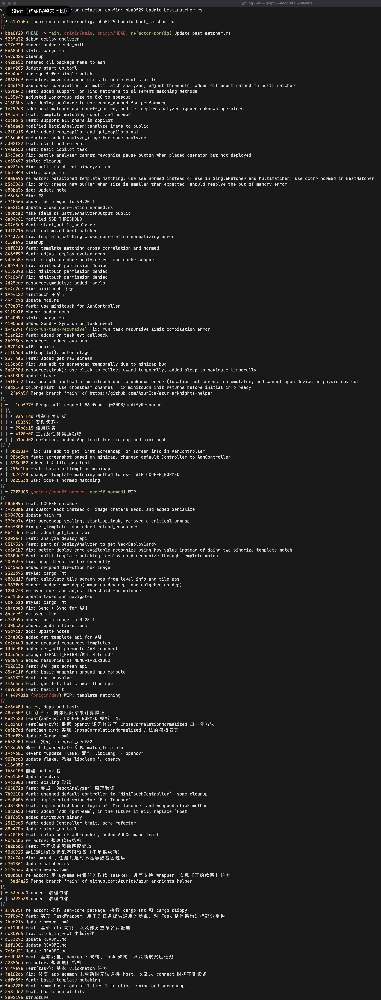

### aah-ai

Github 仓库：https://github.com/AzurIce/aah-ai

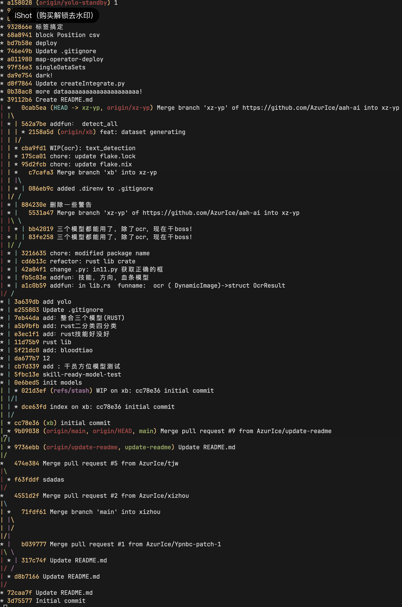

### aah-gui

Github 仓库：https://github.com/AzurIce/aah-gui

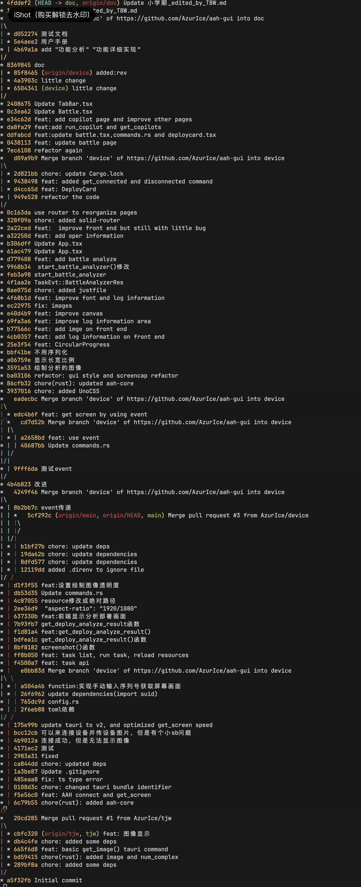


---

